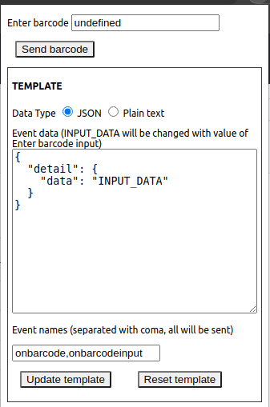

# Barcode simulator extension

## Setup
Activate dev model for extensions. Load /code/ as unpacked extension.

## Usage

Enter barcode - value that will be sent

Data type - do we send JSON or plain text

Event data - what data is sent to event. INPUT_DATA - will be replaced with barcode value

Event names - which events to trigger on window (separated with coma)